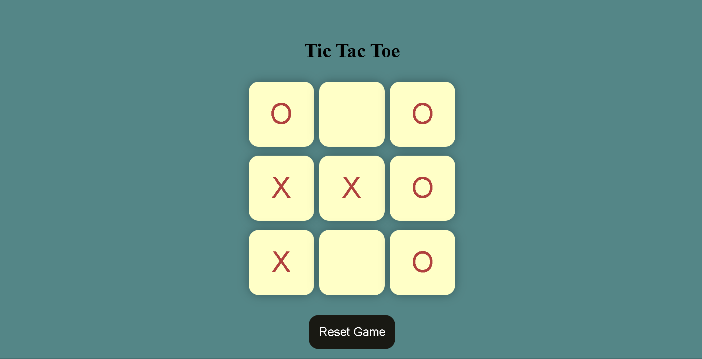
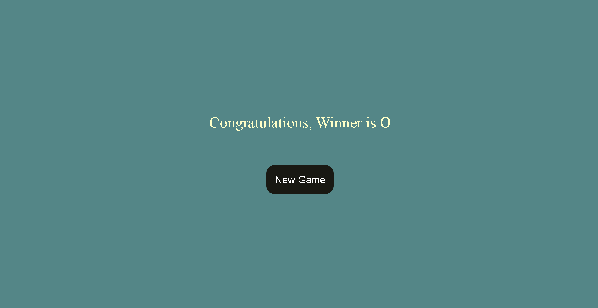

# 🎮 Tic Tac Toe Game

A simple, responsive **Tic Tac Toe** game built using **HTML**, **CSS**, and **JavaScript**.  
Play against a friend in your browser!

---

## 📌 Features

- ✅ Play with two players on the same device.
- 🎨 Clean and responsive user interface.
- 🔄 Restart the game anytime.
- ✨ Simple, beginner-friendly code.

---

## 🚀 Demo

**[👉 Play Live](#)** *(Add your hosted link here if deployed, e.g. GitHub Pages, Netlify, or Vercel)*

---

## 📂 Project Structure
```
tic-tac-toe/
├── index.html
├── style.css
├── script.js
└── README.md
```
---

## ▶️ How to Play

1. Open `index.html`  
   - Double-click `index.html` in your file explorer to open it in your default browser.  
   **OR**
   - Open the project folder in VS Code, install the **Live Server** extension, and click **Open with Live Server** for a live preview.

2. Click on a square to make your move.

3. Players take turns until one wins or the game is a draw.

4. Click the **Restart** button to play again.

---

## 🛠️ Technologies Used

- **HTML5**
- **CSS3**
- **JavaScript (Vanilla)**

---

## 💡 How it Works

- The game board is created using an HTML grid.
- CSS handles the styling and layout.
- JavaScript manages the game logic:  
  - Switching turns (`X` and `O`)  
  - Checking for a winner  
  - Declaring a draw  
  - Resetting the game

---

## ✏️ How to Customize

- 🎨 Change the colors in `style.css` to match your style.
- 🤖 Add simple AI logic to play against the computer.
- 📱 Make it more responsive with media queries.
- 🎉 Add animations or sound effects.

---

## 📸 Screenshots
 



---

## 📑 License

This project is open source and free to use for learning purposes.

---

## 🙌 Author

**Your Name**  
[GitHub](https://github.com/yourusername) | [LinkedIn](https://linkedin.com/in/yourusername)

---

Happy Coding! 🎉
